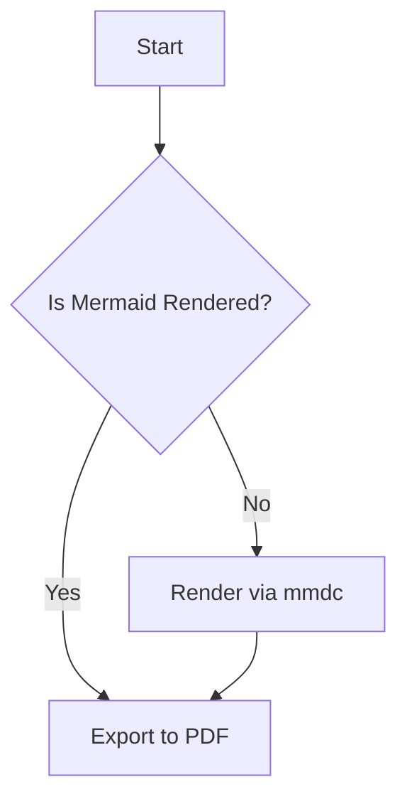

## md-to-pdf-with-mermaid-mcp

Markdown 파일 내 mermaid 코드블록을 SVG로 렌더링한 뒤 이미지 링크로 치환하고, 결과 Markdown을 PDF로 변환하는 MCP 서버입니다. GitHub 저장소를 npx로 직접 실행해 MCP 클라이언트(예: Claude Desktop)에서 도구를 호출할 수 있습니다.

### 주요 기능
- **Mermaid 렌더링**: mermaid 코드블록을 `@mermaid-js/mermaid-cli`로 SVG 생성
- **이미지 치환**: 원본 Markdown에서 Mermaid 블록을 이미지 링크로 대체
- **PDF 변환**: `md-to-pdf` 사용, 실패 시 `pandoc`으로 폴백
- **MCP 도구 제공**: stdio 기반 MCP 서버로 `convert_markdown_to_pdf` 도구 노출

### 요구 사항
- Node.js 18 이상 (ESM 및 MCP SDK 호환)
- 네트워크(최초 실행 시 `md-to-pdf`/`mermaid-cli`가 Chromium 다운로드 가능)
- 선택 사항: `pandoc` 설치(폴백 경로) — macOS: `brew install pandoc`

### 저장소 구조
- `mcp-server.js`: MCP 서버(표준 입출력) 엔트리. 도구 등록 및 입력 검증(zod)
- `md_mermaid_to_pdf.js`: 변환 로직. 라이브러리 함수 `convertMarkdownWithMermaidToPdf` 노출 및 CLI 가드 포함
- `package.json`: 패키지 메타 및 bin 설정 (`md-to-pdf-with-mermaid-mcp`)

## 사용 방법

### 1) MCP 클라이언트에 연결 (Claude Desktop 예시)
MCP 클라이언트 설정에 다음과 같이 등록합니다. GitHub 저장소/태그 정보를 실제 값으로 바꿔주세요.

```json
{
  "mcpServers": {
    "md-to-pdf-with-mermaid": {
      "command": "npx",
      "args": [
        "-y",
        "github:polarnego/md-to-pdf-with-mermaid-mcp"
      ]
    }
  }
}
```

- **권장**: 릴리즈 태그(`v0.1.0` 등)를 사용하여 고정 버전 실행
- npx 실행 시 `-y`를 넣어 비대화형으로 동의 처리

등록 후, MCP 클라이언트의 도구 패널에서 아래 도구를 사용할 수 있습니다.

- **도구명**: `convert_markdown_to_pdf`
- **입력 파라미터**:
  - `inputPath` (string): 입력 `.md`의 절대 경로
  - `outputPath` (string): 출력 `.pdf`의 절대 경로

실행 성공 시 다음과 같은 응답을 반환합니다.

```json
{
  "content": [{ "type": "text", "text": "PDF written: /absolute/path/to/output.pdf" }]
}
```

> 참고: MCP 서버에서는 안전성을 위해 절대 경로만 허용합니다.

### 2) 직접 실행(비-MCP)
로컬에서 변환만 테스트하려면 다음 명령을 사용할 수 있습니다.

```bash
node md_mermaid_to_pdf.js ./example.md ./example.pdf
```

상대/절대 경로 모두 허용되며, 내부에서 자동으로 절대 경로로 변환됩니다.

## 동작 방식
1. 입력 Markdown에서 ```mermaid 코드블록을 정규식으로 탐색합니다.
2. 각 블록을 `.out/diagram_<n>.mmd`로 저장 후, `npx -y @mermaid-js/mermaid-cli`로 SVG 생성
3. 원문 Markdown 내 Mermaid 블록을 해당 SVG의 이미지 링크로 치환
4. 치환된 Markdown을 `.out/<원본>.rendered.md`로 저장
5. `npx -y md-to-pdf`로 PDF 생성 시도 — 실패 시 `pandoc`으로 폴백
6. 최종 PDF를 요청한 `outputPath`로 복사

> 중간 산출물은 입력 파일과 같은 디렉터리 하위의 `.out/` 폴더에 생성됩니다.

## 샘플
`example.md` 파일(UTF-8)을 아래처럼 만들고 변환을 실행해보세요.

```markdown
## Example


```

## 문제 해결(트러블슈팅)
- **Chromium 다운로드 이슈**: `md-to-pdf`/`mermaid-cli`가 Puppeteer 기반으로 Chromium을 다운로드할 수 있습니다. 방화벽/프록시 환경에서는 네트워크 허용 필요.
  - 기존 설치된 브라우저 사용 시 `PUPPETEER_EXECUTABLE_PATH` 환경변수로 경로 지정 가능
- **`pandoc` 폴백 실패**: `pandoc`이 설치되어 있지 않거나 PATH에 없을 수 있습니다. macOS에서는 `brew install pandoc`으로 설치하세요.
- **권한 문제**: 출력 위치 디렉터리에 쓰기 권한이 필요합니다.

## 라이선스
MIT


