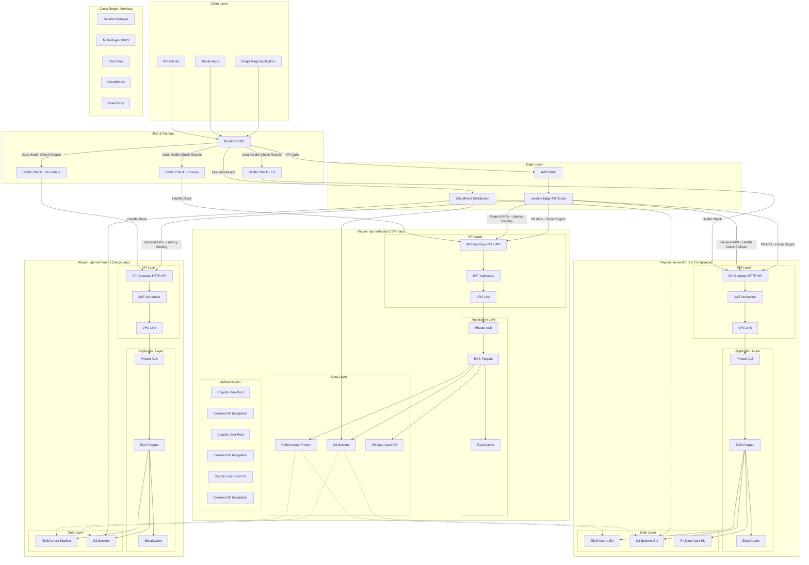
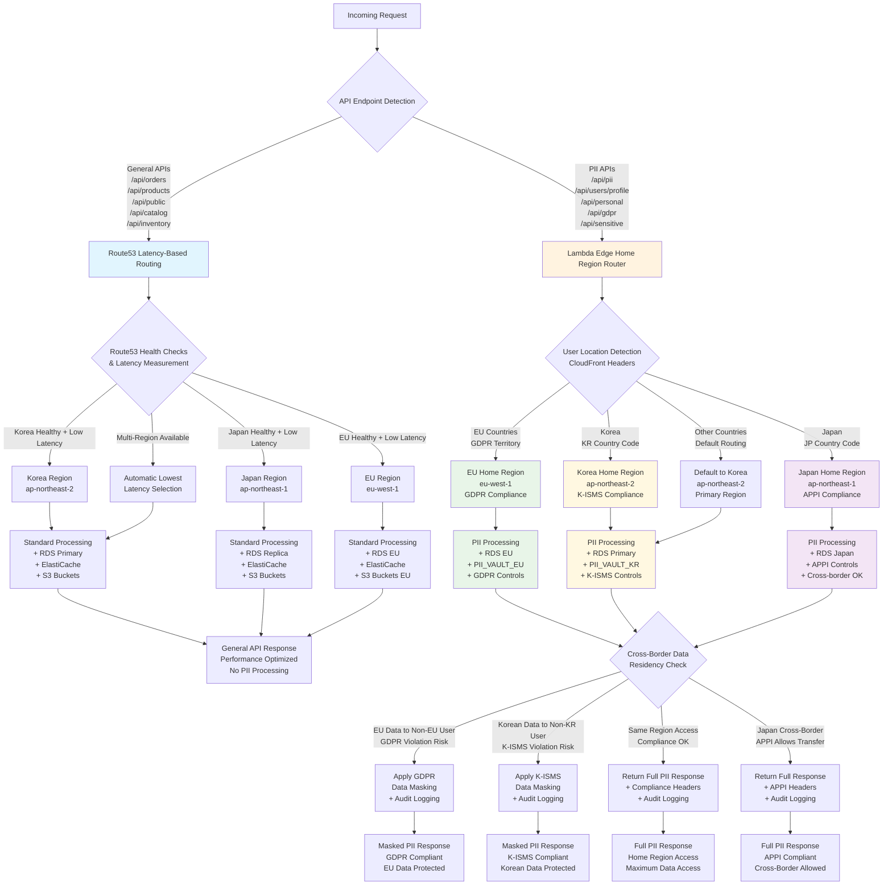

# Design Document

## Overview

This design document outlines the implementation of a multi-region, cloud-native authentication and API system using AWS services. The architecture is centered around Amazon Cognito for identity management, API Gateway with JWT authorizers for secure API access, and a comprehensive multi-region deployment strategy across ap-northeast-2 and ap-northeast-1.

The system follows a microservices architecture with clear separation of concerns, implementing security best practices, and providing high availability through geographic distribution and automated failover mechanisms.

## Architecture

### High-Level Architecture Diagram



### Lambda@Edge Intelligent Routing Architecture

**Edge Computing Layer:**
**Hybrid Routing Strategy:**
The system implements a dual routing approach optimizing performance for general APIs while ensuring compliance for PII APIs:

**1. Route53 Latency-Based Routing (General APIs):**

- Handles all non-PII API endpoints (e.g., /api/orders, /api/products, /api/public/\*)
- Routes traffic to the lowest latency region with healthy endpoints
- Uses weighted routing for load distribution and blue-green deployments
- Provides automatic failover between regions based on health checks

**2. Lambda@Edge PII-Specific Routing (PII APIs Only):**

- Intercepts requests to PII endpoints (e.g., /api/pii/_, /api/users/profile, /api/personal/_)
- Analyzes requests for PII content detection
- Routes to user's designated home region for compliance
- Implements enhanced security controls and audit logging

**3. Edge Processing Functions (PII APIs Only):**

**Viewer Request Function:**

- Detects PII API endpoints and analyzes content
- Determines user's home region based on data residency requirements
- Overrides CloudFront routing for compliance
- Implements enhanced security filtering for sensitive data

**Origin Response Function:**

- Processes responses from PII API backends
- Implements data masking for cross-border responses
- Adds data classification and security headers
- Ensures compliance with regional data protection laws

### PII Data Protection and Regional Compliance

**Data Residency Strategy:**

1. **EU Data (GDPR Compliance):**

   - All EU user PII processed in eu-west-1 region
   - Dedicated Cognito User Pool for EU users
   - Separate Aurora cluster with EU-only data
   - PII data vault with encryption and access controls

2. **Korean Data (K-ISMS Compliance):**

   - Korean user data processed in ap-northeast-2 region
   - Local data residency compliance
   - Enhanced audit logging for regulatory requirements

3. **Global Non-PII Data:**
   - Processed in lowest latency region
   - Cached at edge locations for performance
   - Cross-region replication for availability

**Hybrid Routing Decision Logic:**



### Regional Distribution Strategy

**Primary Region (ap-northeast-2 - Korea):**

- Korean user Cognito User Pool with K-ISMS compliance
- Primary Aurora database cluster for Korean data
- Dedicated PII_VAULT_KR for sensitive Korean data
- Full application stack deployment (ECS, API Gateway, ElastiCache)
- K-ISMS compliance controls and audit logging
- Korean data residency enforcement with cross-border restrictions
- Default region for non-EU/non-JP users

**Secondary Region (ap-northeast-1 - Japan):**

- Backup Cognito User Pool for disaster recovery
- Aurora read replica for non-PII data replication
- Full application stack deployment for failover scenarios
- APPI compliance controls (allows cross-border transfers)
- Regional failover capabilities with health check integration
- No dedicated PII vault (APPI allows cross-border data flow)

**EU Compliance Region (eu-west-1):**

- EU-specific Cognito User Pool for GDPR compliance
- GDPR-compliant Aurora cluster with EU data residency
- Dedicated PII_VAULT_EU with enhanced encryption and access controls
- EU data residency enforcement with strict cross-border restrictions
- GDPR compliance controls (right to be forgotten, data portability, consent management)
- Enhanced audit logging for Article 30 compliance

### Hybrid Routing Implementation Details

**Route53 Latency-Based Routing (General APIs):**

- **Target Endpoints**: `/api/orders/*`, `/api/products/*`, `/api/public/*`, `/api/catalog/*`, `/api/inventory/*`, `/api/health`
- **Routing Logic**: DNS-level routing to region with lowest measured latency
- **Health Checks**: Continuous monitoring of API Gateway endpoints in all regions
- **Failover**: Automatic traffic redirection on regional failures
- **Performance**: Minimal routing overhead, optimal for high-volume APIs
- **No PII Processing**: Bypasses Lambda@Edge for maximum performance

**Lambda@Edge Home Region Routing (PII APIs):**

- **Target Endpoints**: `/api/pii/*`, `/api/users/profile`, `/api/personal/*`, `/api/gdpr/*`, `/api/sensitive/*`, `/api/user-data/*`
- **Routing Logic**: User location-based routing to designated home region
- **Compliance Priority**: Data residency requirements override performance considerations
- **PII Detection**: Advanced pattern matching for various PII data types
- **Cross-Border Protection**: Automatic data masking for compliance violations
- **Enhanced Security**: Additional security headers and audit logging
- GDPR compliance controls (right to be forgotten, data portability)

### Route 53 DNS Strategy

**Latency-Based Routing:**

- Routes users to the region with lowest latency
- Improves user experience by reducing response times
- Automatically adapts to network conditions

**Health Check Configuration:**

- Monitors API Gateway endpoints in both regions
- Checks `/health` endpoint every 30 seconds
- Failover threshold: 3 consecutive failures
- Recovery threshold: 2 consecutive successes

**Failover Routing:**

- Primary-secondary failover configuration
- Automatic traffic redirection on primary region failure
- Session continuity maintained through shared Cognito tokens
- DNS TTL: 60 seconds for fast failover

## Components and Interfaces

### 1. Edge Computing Layer (Lambda@Edge)

**Lambda@Edge Functions:**

**Viewer Request Function (PII APIs Only):**

```javascript
// PII API Detection and Home Region Routing
exports.handler = async (event) => {
  const request = event.Records[0].cf.request;
  const headers = request.headers;
  const uri = request.uri;

  // Only process PII API endpoints
  const piiEndpoints = [
    "/api/pii/",
    "/api/users/profile",
    "/api/personal/",
    "/api/gdpr/",
  ];
  const isPIIEndpoint = piiEndpoints.some((endpoint) =>
    uri.startsWith(endpoint)
  );

  if (!isPIIEndpoint) {
    // Let general APIs continue with standard CloudFront routing
    return request;
  }

  // Determine user's home region for PII compliance
  const userLocation = getUserLocation(headers);
  const homeRegion = determineHomeRegion(userLocation, request);

  // Route to user's home region for compliance
  if (homeRegion === "EU") {
    request.origin.custom.domainName = "api-eu.example.com";
  } else if (homeRegion === "KR") {
    request.origin.custom.domainName = "api-kr.example.com";
  } else {
    request.origin.custom.domainName = "api-default.example.com";
  }

  // Add compliance and audit headers
  request.headers["x-pii-api"] = [{ key: "X-PII-API", value: "true" }];
  request.headers["x-home-region"] = [
    { key: "X-Home-Region", value: homeRegion },
  ];
  request.headers["x-compliance-required"] = [
    { key: "X-Compliance-Required", value: "true" },
  ];

  return request;
};
```

**Origin Request Function:**

```javascript
// Load Balancing and API Versioning
exports.handler = async (event) => {
  const request = event.Records[0].cf.request;

  // Check origin health and load balance
  const healthyOrigins = await checkOriginHealth();
  const selectedOrigin = selectOptimalOrigin(healthyOrigins, request.headers);

  // Handle API versioning
  const apiVersion = request.headers["api-version"]
    ? request.headers["api-version"][0].value
    : "v1";
  request.uri = `/${apiVersion}${request.uri}`;

  // Add authentication context
  const authToken = request.headers.authorization;
  if (authToken) {
    const tokenInfo = await validateTokenAtEdge(authToken[0].value);
    request.headers["x-user-context"] = [
      {
        key: "X-User-Context",
        value: JSON.stringify(tokenInfo),
      },
    ];
  }

  return request;
};
```

**Origin Response Function:**

```javascript
// Data Masking and Security Headers
exports.handler = async (event) => {
  const request = event.Records[0].cf.request;
  const response = event.Records[0].cf.response;

  // Apply data masking for cross-border responses
  const userLocation = request.headers["x-user-location"][0].value;
  const dataResidency = request.headers["x-data-residency"][0].value;

  if (needsDataMasking(userLocation, dataResidency)) {
    response.body = maskPIIData(response.body);
  }

  // Add security headers
  response.headers["strict-transport-security"] = [
    {
      key: "Strict-Transport-Security",
      value: "max-age=31536000; includeSubDomains; preload",
    },
  ];

  response.headers["content-security-policy"] = [
    {
      key: "Content-Security-Policy",
      value: "default-src 'self'; script-src 'self' 'unsafe-inline'",
    },
  ];

  return response;
};
```

**PII Detection Service:**

```javascript
// PII Detection Logic
const PII_PATTERNS = {
  email: /\b[A-Za-z0-9._%+-]+@[A-Za-z0-9.-]+\.[A-Z|a-z]{2,}\b/g,
  phone: /(\+\d{1,3}[- ]?)?\d{10}/g,
  ssn: /\d{3}-\d{2}-\d{4}/g,
  creditCard: /\d{4}[- ]?\d{4}[- ]?\d{4}[- ]?\d{4}/g,
  koreanRRN: /\d{6}-\d{7}/g,
  europeanId: /[A-Z]{2}\d{8,12}/g,
};

function detectPII(request) {
  const requestBody = request.body?.data || "";
  const queryString = request.querystring || "";
  const uri = request.uri || "";

  const content = `${requestBody} ${queryString} ${uri}`;

  for (const [type, pattern] of Object.entries(PII_PATTERNS)) {
    if (pattern.test(content)) {
      return { detected: true, type, content: content.match(pattern) };
    }
  }

  return { detected: false };
}
```

### 2. Authentication Layer (Amazon Cognito)

**Cognito User Pool Configuration:**

```json
{
  "userPool": {
    "poolName": "multi-region-auth-pool",
    "region": "ap-northeast-2",
    "policies": {
      "passwordPolicy": {
        "minimumLength": 12,
        "requireUppercase": true,
        "requireLowercase": true,
        "requireNumbers": true,
        "requireSymbols": true
      }
    },
    "mfaConfiguration": "OPTIONAL",
    "accountRecoverySetting": {
      "recoveryMechanisms": [{ "name": "verified_email", "priority": 1 }]
    }
  },
  "userPoolClient": {
    "clientName": "web-client",
    "generateSecret": false,
    "authFlows": ["ALLOW_USER_SRP_AUTH", "ALLOW_REFRESH_TOKEN_AUTH"],
    "tokenValidityUnits": {
      "accessToken": "minutes",
      "idToken": "minutes",
      "refreshToken": "days"
    },
    "tokenValidity": {
      "accessToken": 15,
      "idToken": 15,
      "refreshToken": 30
    }
  }
}
```

**Resource Server and Scopes:**

```json
{
  "resourceServer": {
    "identifier": "api://orders",
    "name": "Orders API",
    "scopes": [
      { "scopeName": "orders.read", "scopeDescription": "Read orders" },
      {
        "scopeName": "orders.write",
        "scopeDescription": "Create/update orders"
      },
      { "scopeName": "orders.delete", "scopeDescription": "Delete orders" }
    ]
  }
}
```

**External IdP Integration:**

- SAML/OIDC providers (Okta, Azure AD, Google)
- Attribute mapping for roles and tenant information
- LDAP integration through Keycloak/ADFS bridge

### 2. API Gateway Layer

**HTTP API Configuration:**

```yaml
apiGateway:
  type: HTTP
  cors:
    allowOrigins:
      - "https://app.example.com"
    allowMethods: ["GET", "POST", "PUT", "DELETE", "OPTIONS"]
    allowHeaders: ["Authorization", "Content-Type"]

  jwtAuthorizer:
    identitySource: "$request.header.Authorization"
    issuerUrl: "https://cognito-idp.ap-northeast-2.amazonaws.com/{userPoolId}"
    audience: ["api://orders"]

  routes:
    - method: GET
      path: "/orders"
      scopes: ["orders.read"]
      integration:
        type: VPC_LINK
        target: "private-alb"

    - method: POST
      path: "/orders"
      scopes: ["orders.write"]
      integration:
        type: VPC_LINK
        target: "private-alb"
```

**Rate Limiting and Throttling:**

```yaml
throttling:
  burstLimit: 2000
  rateLimit: 1000

usagePlan:
  throttle:
    burstLimit: 1000
    rateLimit: 500
  quota:
    limit: 10000
    period: DAY
```

### 3. Application Layer (ECS Fargate)

**Container Configuration:**

```yaml
ecsService:
  cluster: "multi-region-cluster"
  serviceName: "auth-api-service"
  taskDefinition:
    family: "auth-api-task"
    networkMode: "awsvpc"
    requiresCompatibilities: ["FARGATE"]
    cpu: 512
    memory: 1024

  containerDefinitions:
    - name: "auth-api"
      image: "{account}.dkr.ecr.{region}.amazonaws.com/auth-api:latest"
      portMappings:
        - containerPort: 8080
          protocol: "tcp"
      environment:
        - name: "COGNITO_USER_POOL_ID"
          value: "{userPoolId}"
        - name: "COGNITO_REGION"
          value: "ap-northeast-2"
      secrets:
        - name: "DB_PASSWORD"
          valueFrom: "arn:aws:secretsmanager:region:account:secret:db-password"
```

**Auto Scaling Configuration:**

```yaml
autoScaling:
  minCapacity: 2
  maxCapacity: 20
  targetCPUUtilization: 70
  targetMemoryUtilization: 80
  scaleOutCooldown: 300
  scaleInCooldown: 300
```

### 4. Data Layer

**Aurora Global Database:**

```yaml
auroraGlobal:
  engine: "aurora-mysql"
  engineVersion: "8.0.mysql_aurora.3.02.0"
  primaryRegion: "ap-northeast-2"
  secondaryRegions: ["ap-northeast-1"]

  primaryCluster:
    instanceClass: "db.r6g.large"
    instanceCount: 2
    backupRetentionPeriod: 7
    preferredBackupWindow: "03:00-04:00"

  encryption:
    kmsKeyId: "arn:aws:kms:region:account:key/mrk-key-id"
    storageEncrypted: true
```

**Regional Data Separation:**

```yaml
regionalData:
  sensitiveData:
    strategy: "region-isolated"
    regions:
      - region: "ap-northeast-2"
        database: "sensitive-data-kr"
      - region: "ap-northeast-1"
        database: "sensitive-data-jp"

  synchronization:
    method: "event-driven"
    eventBridge: true
    dlq: true
```

### 5. Storage Layer (S3)

**Bucket Strategy:**

```yaml
s3Buckets:
  staticContent:
    name: "app-static-content-{region}"
    versioning: true
    encryption: "AES256"
    crossRegionReplication: true

  userUploads:
    name: "app-user-uploads-{region}"
    versioning: true
    encryption: "aws:kms"
    lifecyclePolicy:
      - transition: "STANDARD_IA"
        days: 30
      - transition: "GLACIER"
        days: 90

  logs:
    name: "app-logs-{region}"
    encryption: "aws:kms"
    lifecyclePolicy:
      - expiration: 2555 # 7 years
```

### 6. Route 53 DNS Configuration

**Hosted Zone Configuration:**

```yaml
hostedZone:
  domainName: "api.example.com"
  recordSets:
    - name: "api.example.com"
      type: "A"
      routingPolicy: "latency"
      region: "ap-northeast-2"
      alias:
        target: "api-gateway-primary.execute-api.ap-northeast-2.amazonaws.com"
        hostedZoneId: "Z2YN17T5R711GT" # API Gateway hosted zone ID for ap-northeast-2
      healthCheckId: "primary-health-check"
      setIdentifier: "primary-region"

    - name: "api.example.com"
      type: "A"
      routingPolicy: "latency"
      region: "ap-northeast-1"
      alias:
        target: "api-gateway-secondary.execute-api.ap-northeast-1.amazonaws.com"
        hostedZoneId: "ZLY8HYME6SFDD" # API Gateway hosted zone ID for ap-northeast-1
      healthCheckId: "secondary-health-check"
      setIdentifier: "secondary-region"

healthChecks:
  primary:
    type: "HTTPS"
    resourcePath: "/health"
    fqdn: "api-gateway-primary.execute-api.ap-northeast-2.amazonaws.com"
    port: 443
    requestInterval: 30
    failureThreshold: 3

  secondary:
    type: "HTTPS"
    resourcePath: "/health"
    fqdn: "api-gateway-secondary.execute-api.ap-northeast-1.amazonaws.com"
    port: 443
    requestInterval: 30
    failureThreshold: 3
```

**DNS Failover Strategy:**

```yaml
failoverStrategy:
  primaryRecord:
    routingPolicy: "failover"
    failoverType: "PRIMARY"
    healthCheckId: "primary-health-check"
    ttl: 60

  secondaryRecord:
    routingPolicy: "failover"
    failoverType: "SECONDARY"
    healthCheckId: "secondary-health-check"
    ttl: 60

  combinedStrategy:
    # Use latency-based routing when both regions are healthy
    # Automatic failover when primary region fails
    primaryPolicy: "latency"
    fallbackPolicy: "failover"
```

## Data Models

### User Profile Model

```typescript
interface UserProfile {
  sub: string; // Cognito user ID
  email: string;
  email_verified: boolean;
  given_name?: string;
  family_name?: string;
  roles: string[]; // Custom attribute
  tenant_id?: string; // Custom attribute
  idp?: string; // Identity provider
  amr: string[]; // Authentication methods
  created_at: string;
  updated_at: string;
}
```

### JWT Token Claims

```typescript
interface JWTClaims {
  iss: string; // https://cognito-idp.region.amazonaws.com/userPoolId
  aud: string; // api://orders
  sub: string; // User ID
  scope: string; // Space-separated scopes
  roles: string[]; // Custom claim
  tenant_id?: string; // Custom claim
  exp: number; // Expiration timestamp
  iat: number; // Issued at timestamp
  token_use: "access" | "id";
  amr: string[]; // Authentication method reference
}
```

### API Request Context

```typescript
interface APIContext {
  requestId: string;
  userId: string;
  roles: string[];
  tenantId?: string;
  scopes: string[];
  sourceIp: string;
  userAgent: string;
  region: string;
}
```

## Error Handling

### Authentication Errors

```typescript
enum AuthErrorCodes {
  INVALID_TOKEN = "AUTH_001",
  EXPIRED_TOKEN = "AUTH_002",
  INSUFFICIENT_SCOPE = "AUTH_003",
  USER_NOT_FOUND = "AUTH_004",
  ACCOUNT_DISABLED = "AUTH_005",
  MFA_REQUIRED = "AUTH_006",
}

interface AuthError {
  code: AuthErrorCodes;
  message: string;
  details?: Record<string, any>;
  timestamp: string;
  requestId: string;
}
```

### API Gateway Error Responses

```yaml
errorResponses:
  401:
    description: "Unauthorized - Invalid or missing token"
    schema:
      type: object
      properties:
        error:
          type: string
          example: "Unauthorized"
        message:
          type: string
          example: "Invalid JWT token"

  403:
    description: "Forbidden - Insufficient permissions"
    schema:
      type: object
      properties:
        error:
          type: string
          example: "Forbidden"
        message:
          type: string
          example: "Insufficient scope for this operation"

  429:
    description: "Too Many Requests"
    headers:
      Retry-After:
        type: integer
        description: "Seconds to wait before retrying"
```

### Circuit Breaker Pattern

```typescript
interface CircuitBreakerConfig {
  failureThreshold: number; // 5 failures
  recoveryTimeout: number; // 30 seconds
  monitoringPeriod: number; // 60 seconds
  expectedExceptions: string[]; // List of exceptions to count
}
```

## Testing Strategy

### Unit Testing

- **Authentication Service Tests**: Token validation, user profile management
- **Authorization Tests**: Scope checking, role-based access control
- **API Gateway Integration Tests**: JWT authorizer functionality
- **Data Access Layer Tests**: Database operations, caching logic

### Integration Testing

- **End-to-End Authentication Flow**: Registration → Login → Token → API Access
- **Multi-Region Failover**: Primary region failure simulation
- **PII Data Residency**: Cross-border data protection validation
- **Lambda@Edge Routing**: Edge-based intelligent routing testing

## PII Data Protection Architecture

### PII Classification and Detection

**PII Data Types:**

```typescript
enum PIIDataType {
  EMAIL = "email",
  PHONE = "phone",
  SSN = "ssn",
  CREDIT_CARD = "credit_card",
  KOREAN_RRN = "korean_rrn", // Korean Resident Registration Number
  EUROPEAN_ID = "european_id", // European ID numbers
  PASSPORT = "passport",
  DRIVER_LICENSE = "driver_license",
  BANK_ACCOUNT = "bank_account",
  IP_ADDRESS = "ip_address",
}

interface PIIDetectionResult {
  detected: boolean;
  dataTypes: PIIDataType[];
  confidence: number;
  locations: PIILocation[];
  requiredRegion: string;
}

interface PIILocation {
  field: string;
  startIndex: number;
  endIndex: number;
  value: string;
  masked: boolean;
}
```

**Regional Compliance Requirements:**

```typescript
interface RegionalCompliance {
  region: string;
  regulations: string[];
  dataResidencyRequired: boolean;
  allowedTransfers: string[];
  retentionPeriod: number;
  deletionRequired: boolean;
}

const COMPLIANCE_MATRIX: Record<string, RegionalCompliance> = {
  EU: {
    region: "eu-west-1",
    regulations: ["GDPR"],
    dataResidencyRequired: true,
    allowedTransfers: ["adequacy-decision-countries"],
    retentionPeriod: 2555, // 7 years in days
    deletionRequired: true,
  },
  KR: {
    region: "ap-northeast-2",
    regulations: ["K-ISMS", "PIPA"],
    dataResidencyRequired: true,
    allowedTransfers: [],
    retentionPeriod: 1825, // 5 years in days
    deletionRequired: true,
  },
  JP: {
    region: "ap-northeast-1",
    regulations: ["APPI"],
    dataResidencyRequired: false,
    allowedTransfers: ["adequate-protection-countries"],
    retentionPeriod: 1095, // 3 years in days
    deletionRequired: false,
  },
};
```

### Lambda@Edge PII Processing Functions

**Viewer Request Function (PII Detection):**

```javascript
const AWS = require("aws-sdk");

exports.handler = async (event) => {
  const request = event.Records[0].cf.request;
  const headers = request.headers;

  try {
    // Extract request data for PII analysis
    const requestData = {
      uri: request.uri,
      querystring: request.querystring,
      body: request.body?.data
        ? Buffer.from(request.body.data, "base64").toString()
        : "",
      headers: headers,
    };

    // Detect PII in request
    const piiResult = await detectPII(requestData);

    // Determine user location
    const userLocation = getUserLocation(headers);

    // Determine required region based on PII and location
    const requiredRegion = determineRequiredRegion(piiResult, userLocation);

    // Route to appropriate region
    const targetOrigin = getRegionalOrigin(requiredRegion);

    // Update request with routing information
    request.origin = {
      custom: {
        domainName: targetOrigin.domainName,
        port: 443,
        protocol: "https",
        path: targetOrigin.path,
      },
    };

    // Add metadata headers for downstream processing
    request.headers["x-pii-detected"] = [
      {
        key: "X-PII-Detected",
        value: piiResult.detected.toString(),
      },
    ];

    request.headers["x-required-region"] = [
      {
        key: "X-Required-Region",
        value: requiredRegion,
      },
    ];

    request.headers["x-user-location"] = [
      {
        key: "X-User-Location",
        value: userLocation,
      },
    ];

    request.headers["x-compliance-level"] = [
      {
        key: "X-Compliance-Level",
        value: getComplianceLevel(requiredRegion),
      },
    ];

    // Log routing decision for audit
    console.log(
      JSON.stringify({
        requestId: request.headers["x-amzn-requestid"]?.[0]?.value,
        piiDetected: piiResult.detected,
        userLocation: userLocation,
        requiredRegion: requiredRegion,
        targetOrigin: targetOrigin.domainName,
        timestamp: new Date().toISOString(),
      })
    );

    return request;
  } catch (error) {
    console.error("PII detection error:", error);

    // Fallback to secure default (EU region for maximum protection)
    request.origin = {
      custom: {
        domainName: "api-eu.example.com",
        port: 443,
        protocol: "https",
        path: "/api",
      },
    };

    return request;
  }
};

// PII Detection Logic
function detectPII(requestData) {
  const patterns = {
    email: /\b[A-Za-z0-9._%+-]+@[A-Za-z0-9.-]+\.[A-Z|a-z]{2,}\b/gi,
    phone: /(\+\d{1,3}[- ]?)?\d{10}/g,
    ssn: /\d{3}-\d{2}-\d{4}/g,
    creditCard: /\d{4}[- ]?\d{4}[- ]?\d{4}[- ]?\d{4}/g,
    koreanRRN: /\d{6}-\d{7}/g,
    europeanId: /[A-Z]{2}\d{8,12}/g,
  };

  const content = `${requestData.uri} ${requestData.querystring} ${requestData.body}`;
  const detectedTypes = [];

  for (const [type, pattern] of Object.entries(patterns)) {
    if (pattern.test(content)) {
      detectedTypes.push(type);
    }
  }

  return {
    detected: detectedTypes.length > 0,
    dataTypes: detectedTypes,
    confidence: detectedTypes.length > 0 ? 0.9 : 0.0,
  };
}

// User Location Detection
function getUserLocation(headers) {
  // CloudFront provides country code in headers
  const countryCode = headers["cloudfront-viewer-country"]?.[0]?.value;

  if (!countryCode) {
    return "UNKNOWN";
  }

  // Map country codes to regions
  const euCountries = [
    "DE",
    "FR",
    "IT",
    "ES",
    "NL",
    "BE",
    "AT",
    "SE",
    "DK",
    "FI",
    "IE",
    "PT",
    "GR",
    "LU",
    "CY",
    "MT",
    "SI",
    "SK",
    "EE",
    "LV",
    "LT",
    "PL",
    "CZ",
    "HU",
    "RO",
    "BG",
    "HR",
  ];

  if (euCountries.includes(countryCode)) {
    return "EU";
  } else if (countryCode === "KR") {
    return "KR";
  } else if (countryCode === "JP") {
    return "JP";
  } else {
    return "OTHER";
  }
}

// Regional Origin Selection
function getRegionalOrigin(requiredRegion) {
  const origins = {
    EU: {
      domainName: "api-eu.example.com",
      path: "/api",
    },
    KR: {
      domainName: "api-kr.example.com",
      path: "/api",
    },
    JP: {
      domainName: "api-jp.example.com",
      path: "/api",
    },
    OTHER: {
      domainName: "api-global.example.com",
      path: "/api",
    },
  };

  return origins[requiredRegion] || origins["OTHER"];
}
```

**Origin Response Function (Data Masking):**

```javascript
exports.handler = async (event) => {
  const request = event.Records[0].cf.request;
  const response = event.Records[0].cf.response;

  try {
    // Check if response contains PII that needs masking
    const userLocation = request.headers["x-user-location"]?.[0]?.value;
    const requiredRegion = request.headers["x-required-region"]?.[0]?.value;
    const responseRegion = getResponseRegion(response);

    // Apply data masking if cross-border transfer
    if (needsDataMasking(userLocation, requiredRegion, responseRegion)) {
      response.body = await maskPIIInResponse(response.body);

      // Add compliance headers
      response.headers["x-data-masked"] = [
        {
          key: "X-Data-Masked",
          value: "true",
        },
      ];
    }

    // Add security headers
    addSecurityHeaders(response);

    // Add CORS headers based on origin
    addCORSHeaders(response, request);

    return response;
  } catch (error) {
    console.error("Response processing error:", error);
    return response;
  }
};

// Data Masking Logic
async function maskPIIInResponse(responseBody) {
  if (!responseBody) return responseBody;

  try {
    const bodyData = JSON.parse(responseBody);
    const maskedData = maskPIIFields(bodyData);
    return JSON.stringify(maskedData);
  } catch (error) {
    // If not JSON, apply text-based masking
    return maskPIIInText(responseBody);
  }
}

function maskPIIFields(data) {
  const piiFields = ["email", "phone", "ssn", "creditCard", "personalId"];

  if (Array.isArray(data)) {
    return data.map((item) => maskPIIFields(item));
  } else if (typeof data === "object" && data !== null) {
    const masked = {};
    for (const [key, value] of Object.entries(data)) {
      if (piiFields.includes(key.toLowerCase())) {
        masked[key] = maskValue(value);
      } else if (typeof value === "object") {
        masked[key] = maskPIIFields(value);
      } else {
        masked[key] = value;
      }
    }
    return masked;
  }

  return data;
}

function maskValue(value) {
  if (typeof value !== "string") return value;

  // Email masking: user@domain.com -> u***@domain.com
  if (value.includes("@")) {
    const [local, domain] = value.split("@");
    return `${local.charAt(0)}***@${domain}`;
  }

  // Phone masking: +1234567890 -> +123***7890
  if (/^\+?\d+$/.test(value)) {
    return value.substring(0, 4) + "***" + value.substring(value.length - 4);
  }

  // Generic masking: show first and last 2 characters
  if (value.length > 4) {
    return (
      value.substring(0, 2) +
      "*".repeat(value.length - 4) +
      value.substring(value.length - 2)
    );
  }

  return "***";
}
```

### Regional API Architecture

**EU Region (GDPR Compliance):**

```yaml
euRegionStack:
  region: "eu-west-1"

  cognito:
    userPool:
      poolName: "eu-gdpr-compliant-pool"
      dataResidency: "EU_ONLY"
      gdprFeatures:
        rightToBeForgotten: true
        dataPortability: true
        consentManagement: true

  database:
    aurora:
      engine: "aurora-postgresql"
      encryption: "aws:kms"
      backupRetention: 2555 # 7 years
      pointInTimeRecovery: true

  piiVault:
    type: "dedicated-encryption"
    keyRotation: "quarterly"
    accessLogging: "comprehensive"

  compliance:
    gdprProcessor: true
    dataSubjectRights: true
    consentTracking: true
```

**Korean Region (K-ISMS Compliance):**

```yaml
koreanRegionStack:
  region: "ap-northeast-2"

  cognito:
    userPool:
      poolName: "kr-kisms-compliant-pool"
      dataResidency: "KR_ONLY"
      localCompliance:
        auditLogging: "enhanced"
        dataClassification: "sensitive"

  database:
    aurora:
      engine: "aurora-mysql"
      encryption: "aws:kms"
      backupRetention: 1825 # 5 years
      auditLogging: "enabled"

  compliance:
    kismsProcessor: true
    localDataResidency: true
    regulatoryReporting: true
```

### Data Subject Rights Implementation

**GDPR Data Subject Rights:**

```typescript
interface DataSubjectRights {
  rightOfAccess: {
    endpoint: "/api/gdpr/access";
    method: "GET";
    authentication: "required";
    response: "complete-data-export";
  };

  rightToRectification: {
    endpoint: "/api/gdpr/rectify";
    method: "PUT";
    authentication: "required";
    validation: "identity-verification";
  };

  rightToErasure: {
    endpoint: "/api/gdpr/delete";
    method: "DELETE";
    authentication: "required";
    cascade: "all-related-data";
  };

  rightToDataPortability: {
    endpoint: "/api/gdpr/export";
    method: "GET";
    authentication: "required";
    format: "machine-readable";
  };
}
```

**Implementation Example:**

```typescript
// GDPR Data Access Handler
export async function handleDataAccessRequest(
  userId: string
): Promise<GDPRDataExport> {
  // Verify user identity and consent
  await verifyUserIdentity(userId);

  // Collect all user data across systems
  const userData = await collectUserData(userId);

  // Format for data portability
  const exportData: GDPRDataExport = {
    userId: userId,
    exportDate: new Date().toISOString(),
    dataCategories: {
      profile: userData.profile,
      preferences: userData.preferences,
      activityLog: userData.activities,
      consentHistory: userData.consents,
    },
    format: "JSON",
    version: "1.0",
  };

  // Log the access request for audit
  await logDataAccessRequest(userId, "GDPR_ACCESS_REQUEST");

  return exportData;
}

// Data Deletion Handler
export async function handleDataDeletionRequest(userId: string): Promise<void> {
  // Verify deletion is legally compliant
  await verifyDeletionCompliance(userId);

  // Delete user data across all systems
  await deleteUserData(userId);

  // Anonymize historical records
  await anonymizeHistoricalData(userId);

  // Log deletion for audit
  await logDataDeletion(userId, "GDPR_ERASURE_REQUEST");
}
```

This comprehensive design ensures that the multi-region authentication API system can handle PII data according to regional compliance requirements while providing intelligent routing through Lambda@Edge functions. The architecture supports GDPR compliance for EU users, K-ISMS compliance for Korean users, and provides appropriate data protection measures for all users regardless of their location.

- **External IdP Integration**: SAML/OIDC federation flows
- **Cross-Service Communication**: Service-to-service authentication

### Performance Testing

- **Load Testing**: API Gateway throughput, ECS auto-scaling
- **Stress Testing**: Cognito authentication limits, database connections
- **Latency Testing**: Cross-region response times, CDN performance

### Security Testing

- **Penetration Testing**: JWT token manipulation, injection attacks
- **Compliance Testing**: Data residency, encryption at rest/transit
- **Vulnerability Scanning**: Container images, dependencies

### Disaster Recovery Testing

- **Regional Failover**: Automated failover testing
- **Data Recovery**: Backup restoration, cross-region replication
- **RTO/RPO Validation**: Recovery time and data loss objectives

### Monitoring and Alerting Tests

- **Alert Validation**: Threshold breaches, notification delivery
- **Dashboard Accuracy**: Metrics correlation, real-time updates
- **Log Aggregation**: Centralized logging, search functionality
